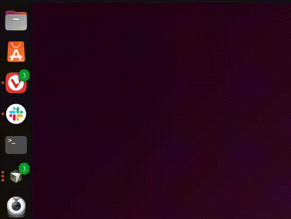
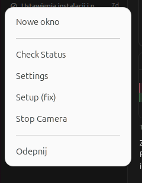

# 📸 Android Webcam for Linux (Wireless)

Turn your Android phone into a professional HD webcam for Linux.
**No dedicated apps required on the phone.** This solution relies on system ADB and the `scrcpy` engine.


-orange?style=flat-square)

[](https://buycoffee.to/kacoze)



## ✨ Why this solution?

Most solutions (DroidCam, Iriun) require installing "bloatware" on both phone and computer, often containing ads or resolution limits. This project offers:

*   🚀 **Zero apps on phone** (uses built-in USB debugging).
*   ⚡ **Ultra low latency** (via ADB over TCP/IP and `scrcpy`).
*   🎥 **High Quality** (HD/Full HD depending on phone).
*   🐧 **Native Integration** (visible as `/dev/video10` in Zoom, Teams, OBS, Chrome).
*   🔋 **Battery Saving** (phone screen typically turns off during operation to save battery).

---

## ⚙️ Requirements

1.  **System:** Linux (tested on Ubuntu 22.04 / 24.04, Debian, Mint, Pop!_OS, KDE Neon, Arch Linux, Manjaro, Fedora, openSUSE, and others).
2.  **Phone:** Android 12 or newer (required for camera mirroring via `scrcpy --video-source=camera`).
3.  **Network:** After initial USB pairing, computer and phone must be on the same Wi-Fi network for wireless operation. USB connection is only required for the initial setup and re-pairing after phone restart.
4.  **Software:** `scrcpy` version 2.0 or newer (installer attempts to handle this automatically). On Ubuntu/Debian, the package manager provides scrcpy &lt; 2.0, so the installer will use Snap, Flatpak, or a direct download from GitHub instead. The installer also installs **Xvfb** so that headless mode (no camera window) works without a visible placeholder.
5.  **Privileges:** ⚠️ **Administrator access (sudo) is required** for installing system packages and kernel modules. The installer will prompt for your password.
6.  **Permissions:** Your user should be in the `video` group to access `/dev/video*` devices. This is usually automatic on most distributions, but you can verify with `groups | grep video`. If not present, add yourself with `sudo usermod -aG video $USER` and log out/in.
7.  **Internet:** ⚠️ **Active internet connection is required ONLY during installation** for:
    - Downloading system dependencies (via package manager)
    - Downloading `scrcpy` from GitHub Releases (if not available via package manager, Snap, or Flatpak)
    
    **Note:** After installation, the tool works completely offline. No internet connection is needed for daily use.

For a clear support/compatibility scope (what is supported automatically, common blockers like Secure Boot, immutable distros, etc.), see: **[`COMPATIBILITY.md`](COMPATIBILITY.md)**.

### Hardware Requirements

- **Kernel:** Linux kernel 3.6 or newer (for v4l2loopback support)
- **Secure Boot:** If enabled, you may need to disable it or sign the v4l2loopback module (see FAQ section)
- **USB:** USB cable for initial pairing (any standard USB cable works)

### 📱 Step 0: Phone Preparation (One-time only)

Before running the installer, you must enable **USB Debugging** on your phone:

1.  Go to `Settings` -> `About phone`.
2.  Tap **Build number** 7 times (until "You are now a developer" appears).
3.  Go back to main menu -> `System` (or Additional settings) -> `Developer options`.
4.  Enable **USB Debugging**.

---


## 📥 Installation (One-Liner)

**⚠️ Before proceeding:**
- Make sure you have **administrator (sudo) privileges** - the installer will prompt for your password
- Ensure you have an **active internet connection** (required only during installation)

Open a terminal (Ctrl+Alt+T) and paste one of the following commands:

**Using wget:**
```bash
wget -qO - https://raw.githubusercontent.com/Kacoze/android-webcam-linux/main/bootstrap.sh | bash
```
(The `-q` flag keeps wget quiet so its progress bar does not mix with the installer output.)

**Or using curl (if wget is not available):**
```bash
curl -fsSL https://raw.githubusercontent.com/Kacoze/android-webcam-linux/main/bootstrap.sh | bash
```

The bootstrap script resolves a release ref, downloads `install.sh`, verifies `install.sh.sha256`, and then runs the installer.

When `ANDROID_WEBCAM_REF` points to a tag (e.g. `vX.Y.Z`), bootstrap prefers downloading release assets from GitHub Releases.

The installer is interactive by default. For non-interactive environments, use `--yes`:

```bash
curl -fsSL https://raw.githubusercontent.com/Kacoze/android-webcam-linux/main/bootstrap.sh | bash -s -- --yes
```

To pin a specific version/ref (recommended for reproducible installs):

```bash
ANDROID_WEBCAM_REF="v1.2.1" curl -fsSL https://raw.githubusercontent.com/Kacoze/android-webcam-linux/main/bootstrap.sh | bash
```

### Installation (Debian/Ubuntu .deb)

If you prefer a package install, download the latest `.deb` from GitHub Releases and install it:

```bash
sudo dpkg -i android-webcam-linux_*.deb
```

### Installation (APT repo)

If GitHub Pages APT repository is enabled for this repo, you can install via APT.

Maintainers: set repository variable `APT_PAGES_ENABLED=1` to publish the APT repo on tag pushes.

Maintainers (recommended): run the `APT Repo (Pages)` workflow manually on `main` and pass the desired tag (GitHub Pages deployments from tags may be blocked by environment rules).

Signed repo (recommended):

```bash
curl -fsSL https://Kacoze.github.io/android-webcam-linux/apt/repo.gpg | sudo gpg --dearmor -o /usr/share/keyrings/android-webcam-linux.gpg
echo "deb [signed-by=/usr/share/keyrings/android-webcam-linux.gpg] https://Kacoze.github.io/android-webcam-linux/apt stable main" | sudo tee /etc/apt/sources.list.d/android-webcam-linux.list
sudo apt update
sudo apt install android-webcam-linux
```

### Installation (Arch/AUR)

This repo includes a PKGBUILD template in `packaging/aur/PKGBUILD`.

### One-liner security model

- `bootstrap.sh` downloads `install.sh` and `install.sh.sha256` from the selected ref.
- By default it verifies checksum before running installer.
- If release lookup fails, bootstrap falls back to `main`.
- `ANDROID_WEBCAM_STABLE_ONLY=1` disables fallback to `main` (fail if no release/assets).
- `ANDROID_WEBCAM_ALLOW_UNVERIFIED=1` bypasses checksum only as an emergency fallback (not recommended).

Optional signature verification:

- If `install.sh.minisig` is available and `minisign` is installed, bootstrap can verify signatures.
- Use `ANDROID_WEBCAM_REQUIRE_SIGNATURE=1` to require signature verification (fails if signature or key is missing).
- Provide the minisign public key via `ANDROID_WEBCAM_MINISIGN_PUBKEY` or keep it in `keys/minisign.pub`.

### Maintainer note (checksum)

When `install.sh` changes, regenerate checksum before publishing:

```bash
./scripts/update-install-checksum.sh
```

The installer is now modularized in `installer/main.sh` and `installer/lib/*.sh`; `install.sh` is a thin wrapper.

CI verifies `install.sh.sha256` and fails if it is out of date.

For CI/smoke tests without full system installation, use:

```bash
bash install.sh --yes --check-only
```

> **Note:** After installation, pair your phone by running `android-webcam-ctl setup` or using the **Setup (fix)** icon in the app menu. Connect the USB cable when prompted, then disconnect. You can also start the camera without prior setup – if IP is not set, setup will run automatically.

The control script `android-webcam-ctl` is installed to `/usr/local/bin`, so it is available in the terminal and from the application menu without adding any directory to your PATH.

---

## 🚀 How to use?

After installation, you will find two new entries in your application menu (Super/Windows key): **Camera Phone** (toggle webcam) and **Setup (fix)** (reconnect after restart). If the icons do not appear immediately, log out and log back in so your desktop refreshes the application list.

### 1. Daily Usage (Wireless)

When you want to join a call:

1.  Ensure your phone has Wi-Fi enabled.
2.  Click the **📷 Camera Phone** icon in the app menu.

**What happens?**

*   A system notification appears: "Android Camera: Active".
*   The phone screen typically turns off automatically (to save battery).
*   Open Zoom/Teams/Discord and select the camera: **Android Cam** (appears as `/dev/video10`).

**To turn off:** Click the **📷 Camera Phone** icon again, or right-click the icon → **Stop Camera**, or use the notification action.

Useful commands:

```bash
android-webcam-ctl start --dry-run
android-webcam-ctl setup
android-webcam-ctl preset meeting
android-webcam-ctl logs
```

### 2. Application Examples

The camera appears as **Android Cam** (device `/dev/video10`) in applications:

**OBS Studio:**
1. Open OBS Studio
2. Add Source → Video Capture Device
3. Select "Android Cam" or "/dev/video10"

**Zoom / Microsoft Teams:**
1. Open video settings
2. Select camera: "Android Cam" or "/dev/video10"

**Discord:**
1. User Settings → Voice & Video
2. Camera: Select "Android Cam"

**Chrome/Chromium (for web apps):**
The camera should appear automatically as "Android Cam" in browser permission dialogs.

### 3. Advanced Controls (Right-Click)

Right-click the **Camera Phone** icon to access:



- **Stop Camera**: Turn off the camera (useful in headless mode, when there is no window to close).
- **Check Status**: See if the camera is running and check current settings. A terminal window opens; press Enter to close it.
- **Settings**: Opening the configuration file allows you to change back/front camera, resolution, etc.
- **Setup (fix)**: Quick access to USB re-pairing tool.

When the camera runs without a window (headless), the dock usually does not show that it is active. Use **Check Status** to confirm it is running, or **Stop Camera** when you are done.

### 4. Emergency Situation (After Phone Restart)

If you restarted your phone or the battery died, Android disables wireless debugging access for security reasons.

1.  Click the **🔧 Setup (fix)** icon (or use Right-Click → Setup (fix)).
2.  A message will appear: "Connect phone via USB cable...".
3.  Connect your phone to the computer for about 3 seconds.
4.  When you see "Done! You can disconnect the cable", disconnect it.

---

## ⚙️ Configuration

You can customize the camera settings by editing the config file (`right-click icon -> Settings`) or running:

```bash
android-webcam-ctl config
```

File location: `~/.config/android-webcam/settings.conf`

```bash
PHONE_IP="192.168.1.50"   # Your phone's Wi-Fi IP address
CAMERA_FACING="front"      # Options: front, back, external
VIDEO_SIZE=""             # Max dimension in pixels (e.g., "1080" for 1080p), leave empty for max resolution
BIT_RATE="8M"             # Higher = better quality, more latency
EXTRA_ARGS="--no-audio --v4l2-buffer=400"  # Additional scrcpy arguments
SHOW_WINDOW="true"        # false = no camera window (headless); image only to /dev/video10
RELOAD_V4L2_ON_STOP="true"  # true = reload v4l2loopback when stopping (so Meet/Zoom see camera on next start); set false if you use other loopback devices
```

### Example Configurations

**High Quality (1080p, 12Mbps):**
```bash
PHONE_IP="192.168.1.50"
CAMERA_FACING="front"
VIDEO_SIZE="1080"
BIT_RATE="12M"
EXTRA_ARGS="--no-audio --v4l2-buffer=400"
```

**Low Latency (720p, 4Mbps):**
```bash
PHONE_IP="192.168.1.50"
CAMERA_FACING="front"
VIDEO_SIZE="720"
BIT_RATE="4M"
EXTRA_ARGS="--no-audio --v4l2-buffer=200"
```

**Front Camera (Selfie Mode):**
```bash
PHONE_IP="192.168.1.50"
CAMERA_FACING="front"
VIDEO_SIZE="1080"
BIT_RATE="8M"
EXTRA_ARGS="--no-audio --v4l2-buffer=400"
```

**Maximum Quality (No Resolution Limit):**
```bash
PHONE_IP="192.168.1.50"
CAMERA_FACING="front"
VIDEO_SIZE=""              # Empty = maximum supported resolution
BIT_RATE="16M"             # High bitrate for best quality
EXTRA_ARGS="--no-audio --v4l2-buffer=400"
```

**Run without camera window (headless):**
```bash
PHONE_IP="192.168.1.50"
CAMERA_FACING="front"
VIDEO_SIZE=""
BIT_RATE="8M"
EXTRA_ARGS="--no-audio --v4l2-buffer=400"
SHOW_WINDOW="false"        # No window; stream only to /dev/video10 (Zoom/Teams etc. still see the camera)
```

#### Run without window (headless)

When `SHOW_WINDOW="false"`, the camera runs in the background with no preview window. The stream is still sent to `/dev/video10`, so apps like Zoom or OBS see "Android Cam" as usual. The dock will not show that the camera is active (no window). To stop the camera or check if it is running: right-click the **Camera Phone** icon → **Stop Camera** to turn it off, or **Check Status** to see the current state. A notification is shown when the camera starts in headless mode as a reminder.

scrcpy still creates a small placeholder window (with its logo) when using `--no-video-playback`. The **installer installs Xvfb** so this placeholder is drawn on a virtual display and is not visible. If you installed the tools manually or the placeholder window still appears, install Xvfb: `sudo apt install xvfb` (Debian/Ubuntu) or equivalent.

**Note:** After changing configuration, restart the camera (stop and start) for changes to take effect.

---

## ❓ FAQ (Frequently Asked Questions)

**Why is the phone screen black?**
This is intentional. The camera runs in the background and streams video directly to the computer. This prevents the phone from overheating and saves battery.

**Image is rotated / Mirrored?**
Most messengers (Zoom/Teams) mirror your video by default (you see yourself reversed), but others see you correctly. You don't need to fix this.

**Quality is poor / lagging?**
Make sure your phone and computer are on the same Wi-Fi network (preferably 5GHz). Weak signal can cause stuttering.

**Camera not visible in Zoom/Teams (/dev/video10 missing)?**
The v4l2loopback kernel module may not be loaded. Check with:
```bash
lsmod | grep v4l2loopback
```
If empty, try loading it manually:
```bash
sudo modprobe v4l2loopback
```
If this fails, you may have Secure Boot enabled. Either disable Secure Boot in BIOS or sign the kernel module.

**Google Meet or Zoom does not detect the camera after I turn the camera off and on again?**
This is caused by a known v4l2loopback quirk with `exclusive_caps=1`: after the producer (our tool) stops, the virtual device can end up in a state where the next start shows the preview window but browsers no longer see the camera. The tool fixes this automatically: when you click **Stop Camera** (or toggle off), it reloads the v4l2loopback module so the next start works correctly. You may see a **password prompt** (PolicyKit) when stopping; enter your user password so the module can be reloaded. If you cancel the prompt (or the reload fails), the next start may still not be visible in Meet/Zoom—click **Stop Camera** once more and accept the prompt. As a last resort, reboot.

**I changed my router / network, what to do?**
If the phone's IP address changed, you can either:

1. Run `android-webcam-ctl setup` (or use the **Setup (fix)** icon) to re-pair and auto-detect the new IP.
2. Edit the config file manually:
   ```bash
   nano ~/.config/android-webcam/settings.conf
   ```
   and update the line:
   ```bash
   PHONE_IP="192.168.1.50"  # Replace with your new phone IP
   ```
3. Or use the config command:
   ```bash
   android-webcam-ctl config
   ```

**What to do when Secure Boot blocks the v4l2loopback module?**
If `sudo modprobe v4l2loopback` fails with a "Required key not available" error, Secure Boot is enabled. You have two options:

1. **Disable Secure Boot** (easier, but less secure):
   - Restart your computer and enter BIOS/UEFI settings (usually F2, F10, F12, or Del during boot)
   - Find "Secure Boot" option and disable it
   - Save and exit, then try `sudo modprobe v4l2loopback` again

2. **Sign the kernel module** (more secure, but complex):
   - This requires generating a Machine Owner Key (MOK) and signing the module
   - Detailed instructions vary by distribution - search for "sign kernel module secure boot" for your distro

**How to check scrcpy version?**
Run one of these commands:
```bash
# If installed via package manager:
scrcpy --version

# If installed via Snap:
/snap/bin/scrcpy --version

# If installed via Flatpak:
flatpak run org.scrcpy.ScrCpy --version

# If installed manually:
~/.local/bin/scrcpy --version
```
The installer requires scrcpy version 2.0 or newer.

**What if the phone doesn't connect via Wi-Fi?**
Troubleshooting steps:

1. **Check if phone and computer are on the same Wi-Fi network** - they must be on the same network for wireless connection to work.

2. **Verify USB debugging is still enabled** - sometimes Android disables it after restart.

3. **Re-run the pairing process** - use the "Setup (fix)" icon or run:
   ```bash
   android-webcam-ctl setup
   ```
   Then connect via USB cable and follow the prompts.

4. **Check phone's IP address** - the IP might have changed. Run:
   ```bash
   android-webcam-ctl status
   ```
   to see the current configuration, or edit the config file manually.

5. **Test ADB connection manually**:
   ```bash
   adb connect YOUR_PHONE_IP:5555
   ```
   Replace `YOUR_PHONE_IP` with your phone's actual IP address.

**Is internet required after installation?**
No. Internet is only required **during installation** for:
- Downloading system dependencies via package manager
- Downloading scrcpy from GitHub (if not available via package manager, Snap, or Flatpak)

After installation, the tool works completely offline. It only needs:
- Your phone and computer on the same Wi-Fi network (for wireless connection)
- Or USB cable connection (for initial pairing)

---

## 🔧 Troubleshooting

Maintainer support checklist: [`SUPPORT.md`](SUPPORT.md)

### Quick diagnostics (recommended first)

Run:

```bash
android-webcam-ctl doctor
```

This command checks the most common blockers (`adb`, `scrcpy >= 2.0`, `/dev/video10`, `v4l2loopback`, Secure Boot hints, config/IP format) and prints quick fix suggestions.

Use machine-readable output:

```bash
android-webcam-ctl doctor --json
```

Doctor exit codes: `0=OK`, `1=FAIL`, `2=WARN`.

### Common Issues

#### Camera not detected in Meet/Zoom after turning camera off and on again

**Symptoms:** You stop the camera, then start it again. The preview window appears and seems to work, but Google Meet, Zoom, or the browser does not list or use the camera. Restarting the PC fixes it.

**Explanation:** This is due to a v4l2loopback limitation with `exclusive_caps=1`. When you click **Stop Camera**, the tool reloads the v4l2loopback module so that the next start uses a clean device and the camera is visible again in Meet/Zoom. A password dialog (pkexec/PolicyKit) may appear when you stop the camera; this is normal and allows the reload to complete. If you cancel it (or the reload fails), click **Stop Camera** again and accept the prompt. As a last resort, reboot.

#### "v4l2loopback module not found" or "/dev/video10 missing"

**Symptoms:** Camera not visible in Zoom/Teams/OBS, or error message about missing video device.

**Solutions:**
1. Check if module is loaded:
   ```bash
   lsmod | grep v4l2loopback
   ```
2. If empty, try loading manually:
   ```bash
   sudo modprobe v4l2loopback
   ```
3. If this fails with "Required key not available", Secure Boot is enabled. See FAQ section for Secure Boot solutions.

#### "scrcpy: command not found" or "scrcpy version too old"

**Symptoms:** Camera fails to start, error about scrcpy not being found or version being too old.

**Solutions:**
1. Check scrcpy version (see FAQ section for commands)
2. Install/update scrcpy:
   - Snap: `sudo snap install scrcpy`
   - Flatpak: `flatpak install flathub org.scrcpy.ScrCpy`
   - Or download from: https://github.com/Genymobile/scrcpy/releases
3. Re-run the installer to auto-detect the new installation

#### "Connection refused" when starting camera

**Symptoms:** Camera fails to start, error about connection being refused.

**Solutions:**
1. **Check if phone and computer are on the same Wi-Fi network** - they must be on the same network for wireless connection to work.
2. **Verify phone's IP address** - the IP might have changed. Run:
   ```bash
   android-webcam-ctl status
   ```
   to see the current configuration.
3. **Re-run the pairing process** - use the "Setup (fix)" icon or run:
   ```bash
   android-webcam-ctl setup
   ```
   Then connect via USB cable and follow the prompts.
4. **Test ADB connection manually**:
   ```bash
   adb connect YOUR_PHONE_IP:5555
   ```
   Replace `YOUR_PHONE_IP` with your phone's actual IP address.

#### "Required key not available" (Secure Boot)

**Symptoms:** `sudo modprobe v4l2loopback` fails with Secure Boot error.

**Solutions:**
See FAQ section "What to do when Secure Boot blocks the v4l2loopback module?" for detailed instructions.

#### Camera shows black screen or no video

**Symptoms:** Camera appears in applications but shows black screen or no video.

**Solutions:**
1. Check if camera is actually running:
   ```bash
   android-webcam-ctl status
   ```
2. Check phone's camera permissions - ensure camera app works on phone
3. Try restarting the camera:
   ```bash
   android-webcam-ctl stop
   android-webcam-ctl start
   ```
4. Check logs: `~/.local/state/android-webcam/logs/latest.log` (legacy path: `/tmp/android-cam.log`)

#### Poor quality or lagging video

**Symptoms:** Video quality is poor or stuttering.

**Solutions:**
1. Ensure phone and computer are on the same Wi-Fi network (preferably 5GHz)
2. Check Wi-Fi signal strength - weak signal can cause stuttering
3. Try increasing bitrate in config (higher = better quality, more latency):
   ```bash
   android-webcam-ctl config
   # Edit BIT_RATE="8M" to higher value like "12M" or "16M"
   ```

---

## 🗑️ Uninstall

If you want to remove the tool:

**If the tool is already installed (easiest):**
```bash
android-webcam-ctl uninstall
```

**If you have the installer locally:**
```bash
./install.sh --uninstall
```

**If you installed via one-liner (`wget ... | bash` or `curl ... | bash`):**
```bash
# Using wget:
wget -qO - https://raw.githubusercontent.com/Kacoze/android-webcam-linux/main/bootstrap.sh | bash -s -- --uninstall

# Or using curl:
curl -fsSL https://raw.githubusercontent.com/Kacoze/android-webcam-linux/main/bootstrap.sh | bash -s -- --uninstall
```

**Alternatively, you can manually delete the files:**

```bash
# Remove script (installed to /usr/local/bin), config, and icons
sudo rm -f /usr/local/bin/android-webcam-ctl
sudo rm -f /usr/local/bin/android-webcam-common
rm -f ~/.local/bin/android-webcam-ctl   # legacy location, if any
rm -rf ~/.config/android-webcam
rm -f ~/.local/share/applications/android-cam.desktop
rm -f ~/.local/share/applications/android-cam-fix.desktop

# Optional: remove system dependencies
# Ubuntu/Debian/Mint:
sudo apt remove -y scrcpy v4l2loopback-dkms v4l2loopback-utils

# Arch/Manjaro:
sudo pacman -Rs scrcpy v4l2loopback-dkms

# Fedora:
sudo dnf remove -y scrcpy v4l2loopback v4l2loopback-utils

# openSUSE:
sudo zypper remove -y scrcpy v4l2loopback-kmp-default v4l2loopback-utils
```

## 🤝 Credits

This project is a wrapper using brilliant Open Source tools:

*   [scrcpy](https://github.com/Genymobile/scrcpy) (Genymobile)
*   [v4l2loopback](https://github.com/umlaeute/v4l2loopback)

## ☕ Support

Did I save you some time or solve a problem for you? A virtual coffee is a great way to say thanks! ☕

[](https://buycoffee.to/kacoze)
